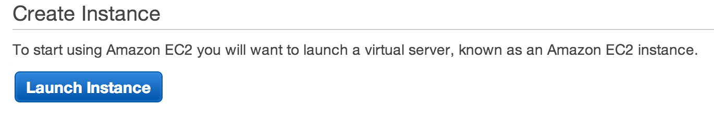
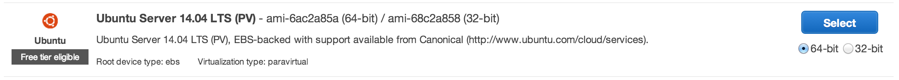
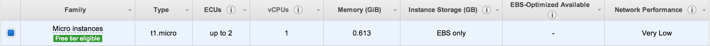
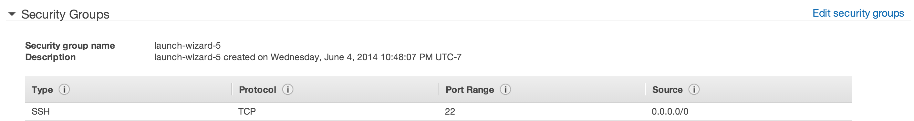
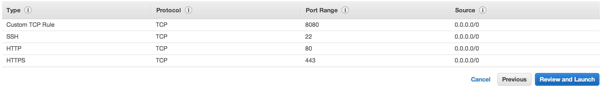
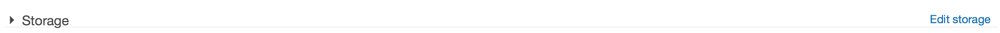
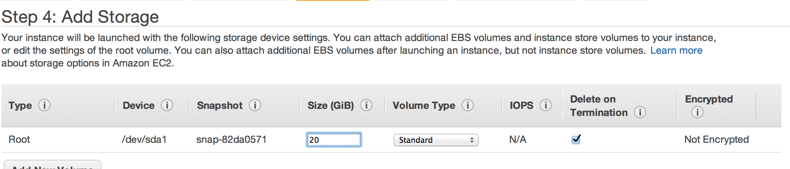
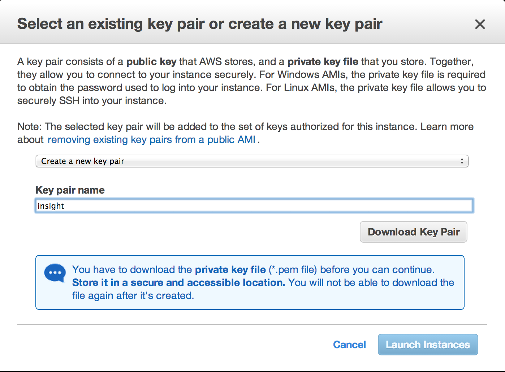
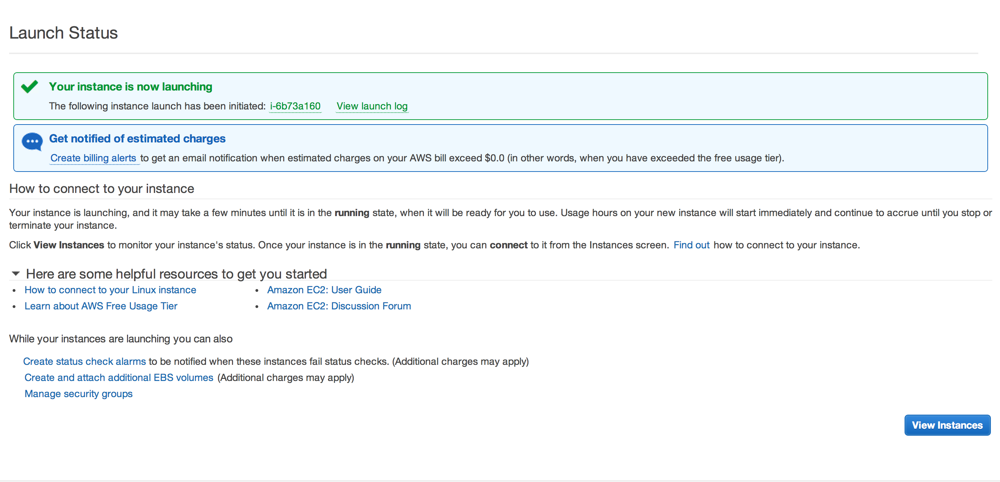

# Launching an Amazon AWS EC2 Instance

1. Navigate to the `AWS Management Console`.

2. Click on the `EC2` icon.

3. Launch an EC2 instance by clicking the `Launch Instance` button.

4. Select the **Ubuntu Server 14.04 LTS** Free tier eligible instance.

5. Choose the `t1.micro` instance and click `Review and Launch`.

6. Click on `Edit Security Groups`.

7. We will be adding several rules to our security group. Click on `Add Rule` each time you want to add
more rules to your security group. Your security group should resemble the following:

When done, click on `Review and Launch`.

8. **Optional**: Click on `Edit Storage`.

Free tier instances allow up to 30GB of disk space. Increase the storage space if needed and click on `Review and Launch`.

9. `Launch` your EC2 instance.

10. Create a new key pair, download it, then click `Launch Instances`.

11. You should now see a Launch Status Screen. Click on `View Instances`.

12. After several minutes, your EC2 instance should be running. You should also now see the Public DNS
for your EC2 instance.

13. Visit [Deploying to AWS](https://github.com/stormpython/insightfl#deploying-to-aws) to deploy your
web application to your EC2 instance.
