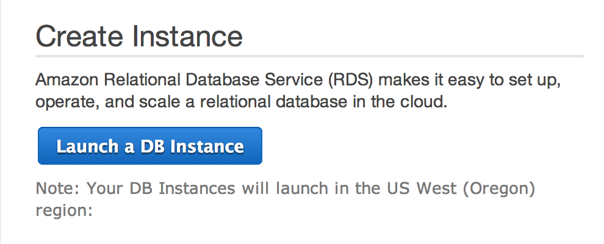
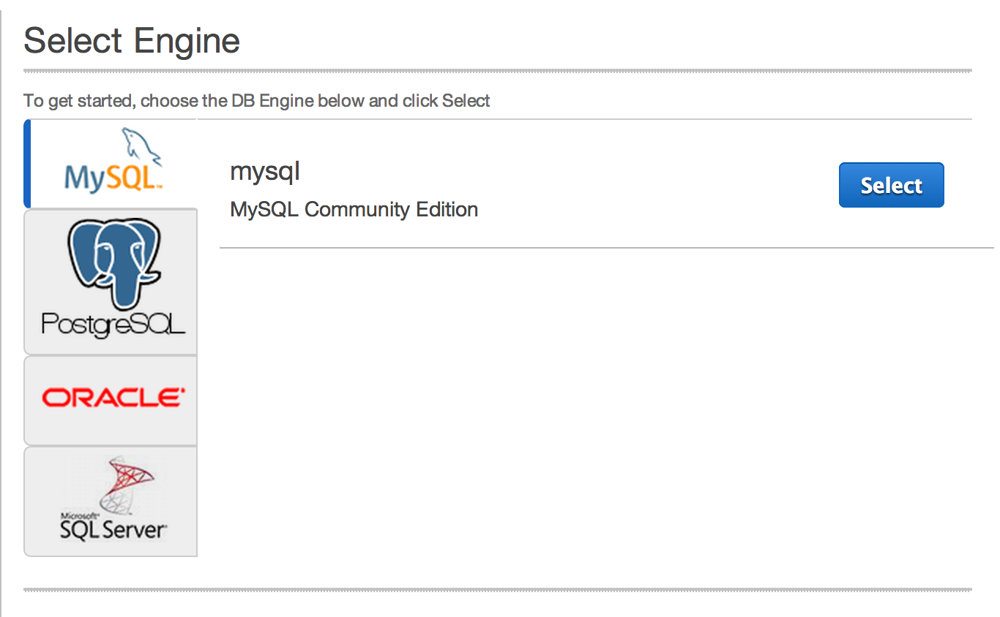
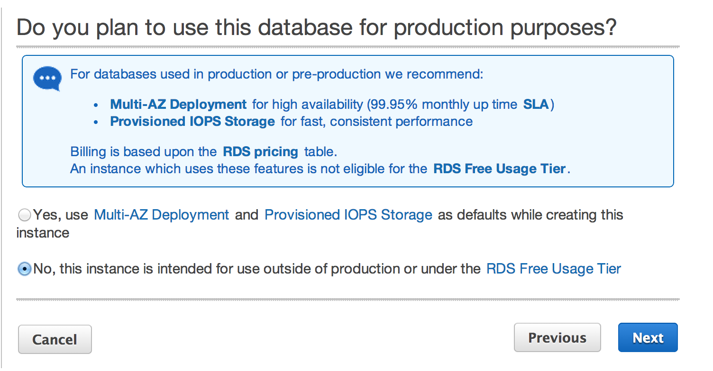
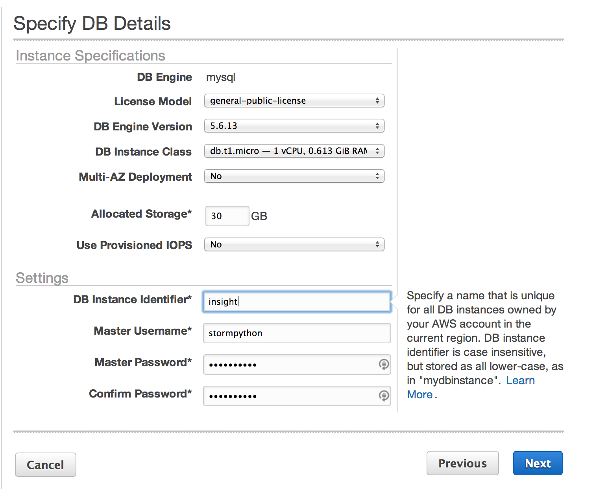
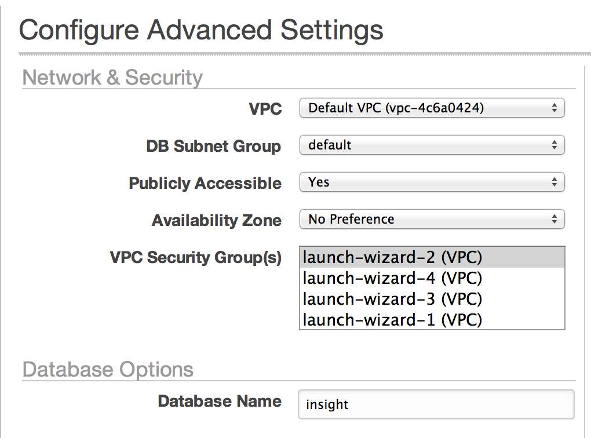
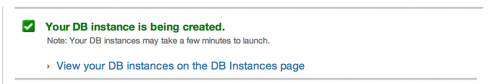
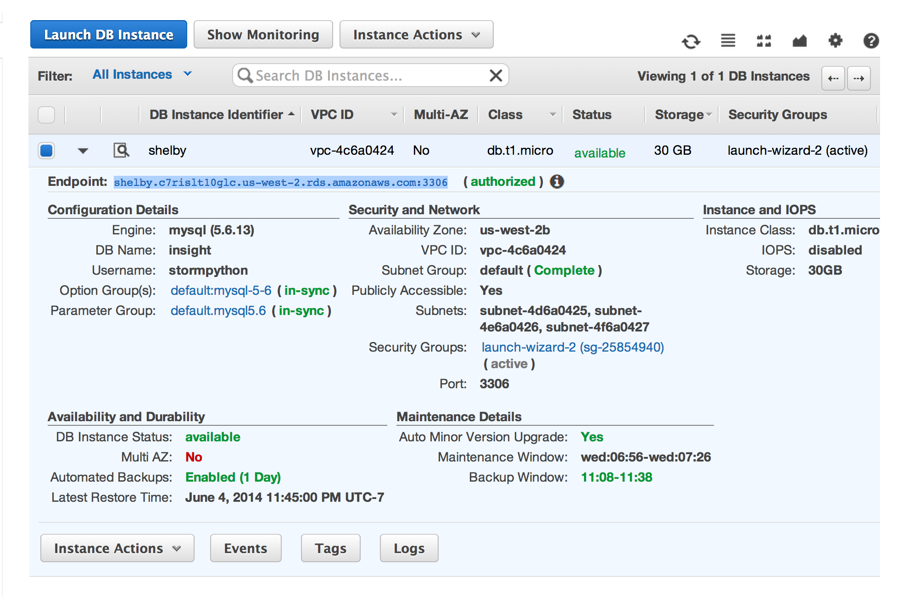

# Creating an Amazon AWS RDS MySQL Database

1. Create an [Amazon AWS](http://aws.amazon.com/) account and sign in. Visit this
[link](https://github.com/stormpython/insightfl/blob/master/docs/requirements.md#amazon-aws)
for account creation instructions.
2. Navigate to the `AWS Management Console`.
    

3. Click on the `RDS` icon.
    

4. Click on `Launch a DB Instance`.
    

5. Select `MySQL Community Edition`.
    

6. Select `No` regarding the production question and click `Next`.
    

7. Specify the DB details. **Be sure to select a `db.t1.micro` instance and select `No` for the Multi-AZ Deployment
option.** You can allocate up to *30GB* of storage. Fill in an identifier, username, and password, then click `Next`.
    

8. Add a `Database Name` in the Configure Advanced Settings step. Then click `Launch DB Instance`.
    

9. Click on `View your DB instances on the DB Instances page`.
    

10. After several minutes, your RDS database should be created. You should now have an RDS Endpoint.
    

11. To connect to your RDS database, open the terminal and type:

    ```
    mysql -h myinstance.123456789012.us-east-1.rds.amazonaws.com -P 3306 -u mymasteruser -p
    ```

12. Congratulations! You have launched your RDS database.
